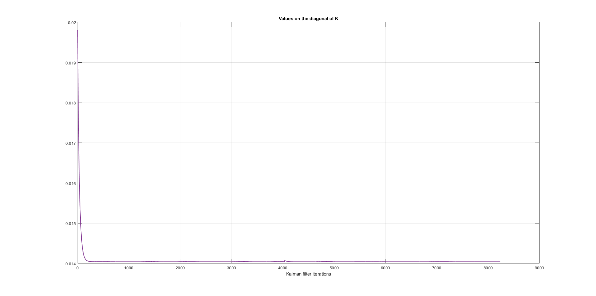
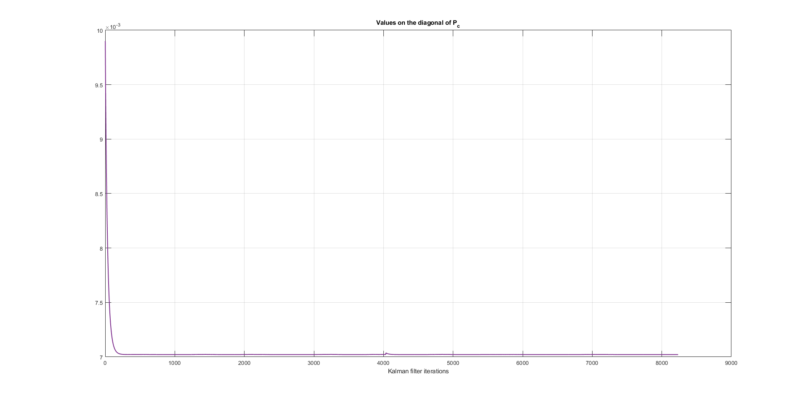
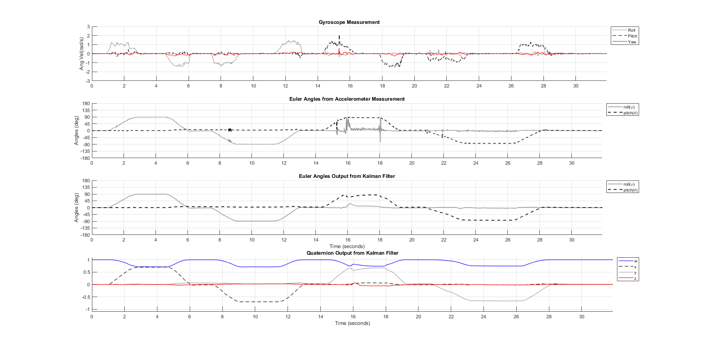

/!\ WORK IN PROGRESS /!\

TO DO:
* verify that the Euler angles computed from the accelerometer reading are really one of and not some kind of cumulative state aka attitude of the system

* Explain how to find the state transition model (F)
* and check if this is angular speed or displacement that is calculated from accelerometer
* how and why to find omega

/!\ WORK IN PROGRESS /!\

# EXAMPLE: Kalman filter for in the context of the 2D attitude of a system

|Times (seconds) | Hand position |
|---:|:---|
|0 - 1| Hand horizontal, palm down, arm extended |
|1 - 3| Rotation |
|3 -5| Clockwise 90&deg; roll (hand set for handshake, thumb at top)|
|5 - 6| Rotation |
|6 - 7.5| Hand horizontal, palm down, arm extended |
|7.5 - 9| Rotation |
|9 - 11.5| Counter-Clockwise 90o roll (thumb is at bottom of hand)|
|11.5 - 13| Rotation |
|13 - 14.5| Hand horizontal, palm down, arm extended |
|14.5 - 16| Rotation |
|16 - 18| Upwards 90o pitch (palm points away from body, as if signaling “stop”)|
|18 - 19|  Rotation |
|19 - 21| Hand horizontal, palm down, arm extended |
|21 - 23| Rotation |
|23 - 26.5| Downwards 90o pitch (palm of hand pointing towards body)
|26.5 - 28.5| Rotation|
|28.5 - 31| Hand horizontal, palm down, arm extended |

Euler to quaternion equation

https://en.wikipedia.org/wiki/Conversion_between_quaternions_and_Euler_angles#Euler_angles_(in_3-2-1_sequence)_to_quaternion_conversion

$$
\mathbf{q} = [w,(x,y,z)]
$$

$$
w = \cos(\frac{\psi}{2}) \cdot \cos(\frac{\theta}{2}) \cdot \cos(\frac{\phi}{2}) + \sin(\frac{\psi}{2}) \cdot \sin(\frac{\theta}{2}) \cdot \sin(\frac{\phi}{2})
$$

$$
x = \sin(\frac{\psi}{2}) \cdot \cos(\frac{\theta}{2}) \cdot \cos(\frac{\phi}{2}) - \cos(\frac{\psi}{2}) \cdot \sin(\frac{\theta}{2}) \cdot \sin(\frac{\phi}{2})
$$

$$
y = \cos(\frac{\psi}{2}) \cdot \sin(\frac{\theta}{2}) \cdot \cos(\frac{\phi}{2}) + \sin(\frac{\psi}{2}) \cdot \cos(\frac{\theta}{2}) \cdot \sin(\frac{\phi}{2})
$$

$$
z = \cos(\frac{\psi}{2}) \cdot \cos(\frac{\theta}{2}) \cdot \sin(\frac{\phi}{2}) - \sin(\frac{\psi}{2}) \cdot \sin(\frac{\theta}{2}) \cdot \cos(\frac{\phi}{2})
$$

# Start up

First, we close all figure and clear all variables in the workspace to be sure we don't face any intereferences.

# Initialisation

The covariance of the matrix noise $\mathbf{Q}$ is initialised with the value: 

$$
\mathbf{Q} = 
\begin{pmatrix}
0.0001 & 0 & 0 & 0\\
0 & 0.0001 & 0 & 0\\
0 & 0 & 0.0001 & 0\\
0 & 0 & 0 & 0.0001\\
\end{pmatrix}
$$

It represent the uncertainty associated with the state transition model $\mathbf{F}$. The values chosen by the authors are relatively low, and represent a good trust in the state transition model $\mathbf{F}$ based on the gyroscope measurements. 

All off-diagonal elements were set to $0$, and the diagonal elements were set to be equals, as the authors didn't had any guidelines to follow and didn't had a clear model of the sytsem and associated noise. This was also the building framework for the covariance matrix of the state vector, $\mathbf{P}(0)$, and covariance matrix of the sensor noise, $\mathbf{R}$ values too.

The initial value of the covariance matrix of the state vector, $\mathbf{P}(0)$, is set to:

$$
\mathbf{P}(0) = 
\begin{pmatrix}
0.001 & 0 & 0 & 0\\
0 & 0.001 & 0 & 0 \\
0 & 0 & 0.001 & 0 \\
0 & 0 & 0 & 0.001\\
\end{pmatrix}
$$

The initial value of the state vector, $\vec{x}(0)$, is set to:

$$
\vec{x}(0)=
\begin{pmatrix}
1\\
0\\
0\\
0\\
\end{pmatrix}
$$

The state vector $\vec{x}$ is put in a quaternion form for precision reasons and mathematical form convenience. The first value is the magnitude of the quaternion, and then the three other values represent the rotations on $\hat{x}$, $\hat{y}$ and $\hat{z}$.

The covariance matrix of the sensor noise $\mathbf{R}$ was set to:

$$
\mathbf{R} = 
\begin{pmatrix}
0.5 & 0 & 0 & 0\\
0 & 0.5 & 0 & 0\\
0 & 0 & 0.5 & 0\\
0 & 0 & 0 & 0.5\\
\end{pmatrix}
$$

The value of the covariance matrix of the sensor noise $\mathbf{R}$ is set higher than for the $\mathbf{Q}$ and $\mathbf{P_0}$, as we have a higher trust in those values than in the angles measurement values calculated from the accelerometer values.

# Finding $\mathbf{F}$

$$
\mathbf{q}(t+\Delta t) \approx
\begin{pmatrix}
\mathbf{I}_4+\frac{\Delta}{2} \cdot \Omega
\end{pmatrix} \cdot \mathbf{q}(t) 
$$

$$
\Omega = \begin{pmatrix}
0 & \omega_w & -\omega_v & \omega_u\\
-\omega_w & 0 & \omega_u & \omega_v\\
\omega_v & -\omega_u & 0 & \omega_w\\
-\omega_u & -\omega_v & -\omega_w & 0\\
\end{pmatrix}
$$

$$
\mathbf{F}(t) = \mathbf{I}_4 + \frac{\Delta t}{2}\cdot \Omega
$$

# Finding $\vec{z}$

$$
a_x=g\sin(\theta)
$$

$$
a_z=g\sin(\theta)
$$

$$
a_y=-g\cos(\theta)\sin(\phi)
$$

$$
a_z=-g\cos(\theta)\sin(\phi)
$$

Normalized, by gravity, equations: 

$$
\bar{a_x}=\sin(\theta)
$$

$$
\bar{a_y}=-\cos(\theta)\sin(\phi)
$$

$$
\bar{a_z}=-\cos(\theta)\sin(\phi)
$$

$$
sin(\phi)= -\frac{\bar{a_y}}{cos(\theta)}
$$

$$
cos(\phi)= -\frac{\bar{a_z}}{cos(\theta)}
$$

Therefore:

$$
\theta = \sin^{-1}(a_x)
$$

$$
\phi = sin^{-1}\begin{pmatrix}\frac{-a_y}{\cos(theta)}\end{pmatrix}
$$

# Results

The Kalman gain $\mathbf{K}$ value is of interest to us as it shows how much trust we put in the state we are computing through the Kalman filter. Carefull, it doesn't necesseraly means that our state is the Truth (in the pure sense of the term), but simply that its uncertainity decrease, and that our trust (in the human sense of the term) in it increase. A bad Kalman filter will give you a trustful wrong state value, while a good Kalman filter will give you a trustful right state value.

Here we can see that the value of the Kalman filter lower relatively quickly for our application and stabilize, which seems to show that our implementation is stable and converge.

As expected from the Kalman gain $\mathbf{K}$ values, the value of the covariance of the state vector $mathbf{P}$ lower as does the uncertainity about the state vector, as well as with the increase in trust in the state vector from our Kalman filter.

The angles values above show us the effect of the Kalman filter which seems to give adequat results for the application.

# Sources

* BARRETO, Armando, ADJOUADI, Malek, ORTEGA, Francisco, et al. [Intuitive Understanding of Kalman Filtering with MATLAB®](https://www.taylorfrancis.com/books/mono/10.1201/9780429200656/intuitive-understanding-kalman-filtering-matlab%C2%AE-armando-barreto-malek-adjouadi-francisco-ortega-nonnarit-larnnithipong). ISBN-13: 978-0367191337. CRC Press, 2020.

* WERTZ, James R. (ed.). [Spacecraft attitude determination and control](https://link.springer.com/book/10.1007/978-94-009-9907-7). Springer Science & Business Media, 1978.

* YUN, Xiaoping, BACHMANN, Eric R., et MCGHEE, Robert B. [A simplified quaternion-based algorithm for orientation estimation from earth gravity and magnetic field measurements](https://apps.dtic.mil/sti/pdfs/ADA601113.pdf). IEEE Transactions on instrumentation and measurement, 2008, vol. 57, no 3, p. 638-650.
